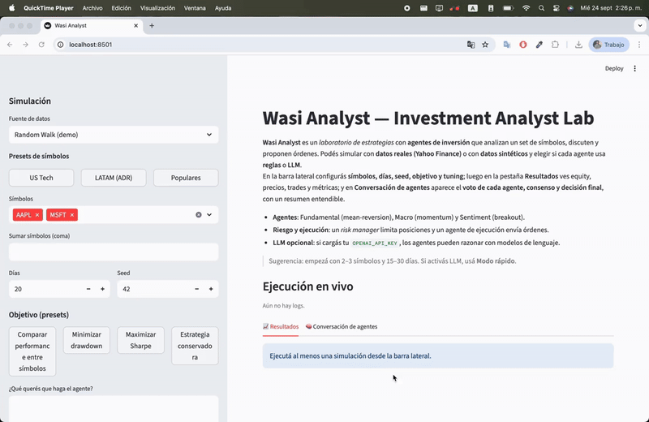

# Wasi Analyst — Investment Analyst Lab

**Wasi Analyst** es un laboratorio de estrategias con **agentes de inversión** que analizan un set de símbolos, discuten y proponen órdenes.  
Permite simular con **datos reales (Yahoo Finance)** o **sintéticos (random walk)**, alternando entre **reglas** o **LLM** por agente.

## Demo
Aquí un ejemplo de cómo funciona la app:



## Características

- **Agentes**:
  - **Fundamental** (mean‐reversion con umbral adaptativo por volatilidad)
  - **Macro** (momentum)
  - **Sentiment** (breakout por máximos/mínimos)
- **Coordinación**: cada agente vota BUY/SELL/HOLD; se calcula **consenso** y pasa por **Risk Manager** antes de ejecutar.
- **Fuentes de datos**:
  - **Yahoo Finance (daily)** con `yfinance`
  - **Random Walk (demo)** para correr rápido sin red
- **UI con Streamlit**:
  - Barra lateral: símbolos, días, seed, objetivo, **modo por agente** y **tuning avanzado**.
  - Pestaña **Resultados**: equity, precios, estados, trades, métricas (CAGR, Sharpe, MaxDD).
  - Pestaña **Conversación de agentes**: tabla por símbolo con **voto por agente**, **consenso** y **final (post-riesgo)** + reasoning corto.
- **LLM opcional** (OpenAI): los agentes pueden razonar con modelos de lenguaje si configurás `OPENAI_API_KEY`.

---

## Requisitos

- Python 3.9+ (probado con 3.11–3.13)
- macOS / Linux / Windows
- Conexión a internet si usás **Yahoo Finance** o **LLM**

---

## Instalación

```bash
# 1) Clonar y entrar
git clone <tu-repo> wasi-analyst
cd wasi-analyst

# 2) Crear entorno
python3 -m venv .venv
source .venv/bin/activate           # en Windows: .venv\Scripts\activate

# 3) Instalar en modo editable + deps
python -m pip install --upgrade pip setuptools wheel
python -m pip install -e .
python -m pip install yfinance streamlit
# LLM opcional
python -m pip install openai python-dotenv
```

### Variables de entorno (opcional LLM)

Crea un archivo `.env` en la raíz:

```
OPENAI_API_KEY=sk-xxxxxx
# opcionales
OPENAI_MODEL=gpt-4o-mini
OPENAI_TEMPERATURE=0.2
```

> Si no configurás `.env`, los agentes funcionan igual en **modo reglas**.

---

## Cómo usar

### Opción A: UI (recomendada)

```bash
# desde la raíz del repo (con el venv activo)
wasi-ui
# o:
streamlit run src/wasi_analyst/ui/app.py
```

1. En la barra lateral:
   - **Fuente de datos**: _Random Walk (demo)_ o _Yahoo Finance (daily)_.
   - **Presets de símbolos**: US Tech / LATAM (ADR) / Populares, o agregá manualmente (AAPL,MSFT,…).
   - **Días** y **Seed** de la simulación.
   - **Objetivo** (presets o libre).
   - **Modo por agente**: `rule` o `llm` (si tenés `.env`).
   - **Tuning avanzado**:
     - Fundamental: ventana SMA, umbral base (bps), cap de cantidad.
     - Macro: ventana de momentum, umbral (bps), cap de cantidad.
     - Sentiment: ventana hi/lo, epsilon (bps), cantidad fija.
   - (Opcional) **Modo rápido**: si usás LLM, limita días para respuestas ágiles.

2. Presioná **Run**.

3. Pestañas:
   - **📈 Resultados**: Equity, precios, tabla de estados, trades, métricas y notas.
   - **🧠 Conversación de agentes**: por día, verás **votos por agente**, **consenso**, **decisión final**, reasoning breve y detalle por símbolo.

### Opción B: CLI

```bash
wasi --help
```

> *Nota:* por ahora el comando `wasi` expone flags básicos. La UI es el “camino feliz”.

---

## Ejemplos de uso

- **Comparar performance entre símbolos**:
  - Objetivo: “Comparar performance entre símbolos”.
  - Preset: US Tech → AAPL, MSFT, NVDA.
  - Días: 30–60.
  - Agentes en modo **rule** (rápido).
- **Estrategia conservadora**:
  - Aumentá “Umbral base” en Fundamental, subí Epsilon en Sentiment.
  - Cap de cantidades más bajo (5–10).
- **Explorar con LLM**:
  - Cargá `.env`.
  - Activá LLM en 1–2 agentes.
  - Usá **Modo rápido** (15 días), 2–3 símbolos.

---

## Arquitectura (alto nivel)

```
wasi_analyst/
├─ app/
│  ├─ run.py               # orquesta la simulación y expone run_simulation
│  └─ cli.py               # CLI opcional
├─ agents/
│  ├─ base.py              # estado, tipos y clase base
│  ├─ fundamental_agent.py # mean-reversion
│  ├─ macro_agent.py       # momentum
│  ├─ sentiment_agent.py   # breakout
│  ├─ risk_manager.py      # límites de riesgo
│  └─ execution_agent.py   # transforma acciones en órdenes
├─ core/
│  ├─ market.py            # ciclo de precios y matching
│  └─ orderbook.py         # órdenes y trades
├─ data/
│  └─ providers.py         # RandomWalkProvider / YahooDailyReplay
├─ ui/
│  └─ app.py               # Streamlit UI
└─ util/
   ├─ config.py            # parametros de simulación y tuning
   ├─ metrics.py           # métricas y utilidades
   └─ store.py             # persistencia (DuckDB) opcional
```

---

## Consejos de tuning

- **Más señales**:
  - Bajá umbrales (bps) en Macro/Sentiment.
  - Reducí ventanas (más reactivo).
- **Menos rotación**:
  - Subí umbrales y/o aumentá ventanas.
  - Bajá caps de cantidad.
- **Volatilidad alta**:
  - Fundamental ya ajusta por `vol`, pero podés subir `fundamental_base_bps`.

---

## Solución de problemas

- **“to_pandas() is not a valid Streamlit command”**  
  No guardes objetos de Streamlit (`st.status`, `st.progress`, etc.) en `st.session_state`.  
  Wasi guarda solo **logs de texto** en `exec_logs`.

- **Presets LATAM fallan en multiselect**  
  El selector usa `ALL_OPTIONS` y el default se intersecta. Si agregás nuevos presets, incluilos en `ALL_OPTIONS`.

- **Yahoo Finance lento la primera vez**  
  La descarga inicial puede tardar. Luego queda cacheado por sesión.

- **LLM no responde**  
  Revisá `.env` y conectividad. Probá **Random Walk** para descartar problemas de datos.

---

## Roadmap

- Presets de tuning (Conservador / Neutro / Agresivo).
- Backtesting con comisiones/slippage más realistas por libro de órdenes simulado.
- Exportación a notebook y a PDF con reporte.
- Más fuentes de datos (intraday).

---

## Research Inspiration

This project is inspired by ideas from the paper [WASI: World Agent-based Simulation for Investment](https://arxiv.org/pdf/2407.18957).  
See [PAPER_INSPIRATION.md](PAPER_INSPIRATION.md) for a summary and how it connects to this repo.

---

## Licencia

MIT. Ver `LICENSE` si corresponde.
